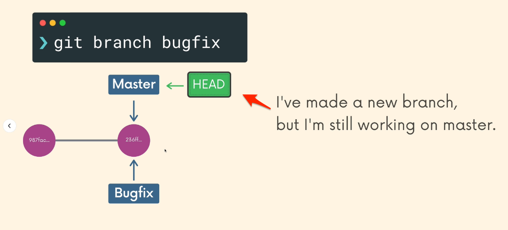
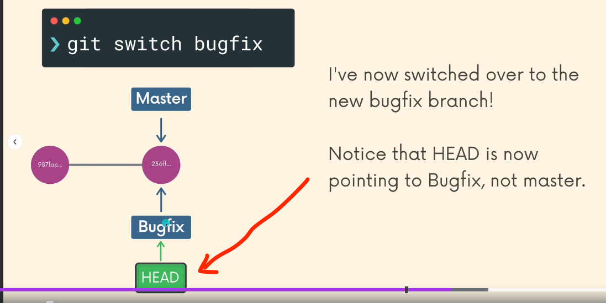

# HEAD: a pointer that points to one particular Commit in a BRANCH.
  - can be moved around. 
  - think of branches as bookmarks in a book; only 1 bookmark can be opened at any one time by that 1 developer.

# Docs: Git Branch
https://git-scm.com/docs/git-branch
  - No arg version just lists out current branches in the repo.
  - When using this commands to create a new branch, HEAD still points to main.  (Lesson45)

# git switch \<branch-name\>
https://git-scm.com/docs/git-switch  (Lesson46)
  - switching changes the HEAD to points to the different branch.
s
  - **Note**: if the changes in a **tracked** file(s) are not yet committed (but tracked in other branches), trying to switch branch would get a warning saying go-ahead would LOSE those changes. (Lesson 49)

# git commit -a -m "message"
  1. Do an 'git add' the untracked file in current directory to staging.
  2. THEN, do an 'git commit' on the current branch in 1 shot.

# Note:
  - **(Key)** When using 'git branch \<new\>', the new branch is created **based off of the current HEAD**.  So **WHERE** this command is issued matters a lot. (Lesson 47)

# git checkout \<branch-name\>
  - Create a branch AND switch to it.

# git switch -c \<branch-name\>
  - Create a branch **AND switch** to it in one go.  (Lesson 48)

# git branch -d \<branch\>
  - deleting a branch.  (Lesson 50)
  - User can't issue this when currently on the branch.
  - User can't issue this when branch **hasn't been merged** into its upstream branch yet.
# git branch -D \<branch\>
  - Force delete a branch.

# git branch -m \<new-branch-name\>
  - Move a branch; needs to be **on** the branch first.  (Lesson 50)

# CheatSheet: 
https://www.git-tower.com/blog/git-cheat-sheet/

# Section6 Exercise:
https://plum-poppy-0ea.notion.site/Branching-Exercise-b5460c881d56400cb046357d9a430bf8

# git log --all --graph --oneline
  - show branches graph in terminal.

# Old command to switch branch:
## git checkout